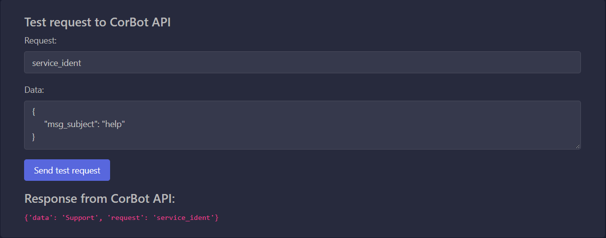
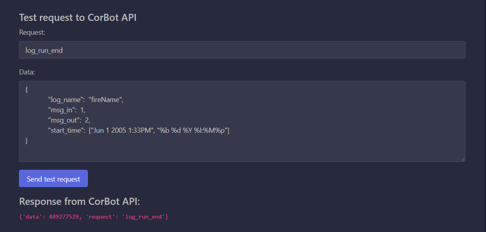

# CorBot API

## How to add modules

1. Add module file of module folder to `app/controllers` folder. E.g. `app/controllers/runner` - python module folder.
1. Import Register class:

    ```python
    from app.controllers.register import Register
    ```

1. Create Register instance with class name:

    ```python
    runner = Register("Runner")
    ```

1. Declare python function as request handler:

    ```python
    @runner.register()
    def service_ident(data):
        pass
    ```

    1. Decorator `@runner.register()` uses for registration this python function as API request handler
    1. Function must by follow prototype:

        ```python
        def request_name(data: dict) -> dict:
            return {}
        ```

    1. If need use different request name, use `name` argument in decorator. For example:

        ```python
        @runner.register(name="request_name")
        def func_name(data):
            pass
        ```

1.  Сonvert function responce to standart format using `dispatch`.

     ```python
        dispatch(request_data: dict)
        # dispatch does all work, except converting to json
        # if you need to convert to json format:
            json.dumps(dispatch(json_data))
     ```


2.  Check for existing classes and methods using `loockup` function.

    1. If class or method exist:

        ```python
        found_method = Register.lookup('get_page_limit', 'Runner')
        print(found_method)
        # result: "<function get_page_limit at 0x7f38dd0f7e50>"
        ```

        Where the first argument it's a `method name` and the second - `class name`.


    2. If class or method do not exist will be raise Exception:

        ```python
        found_class = Register.lookup('add_page', 'News')
        # result:
            Traceback (most recent call last):
            File "<console>", line 1, in <module>
            File "/home/vitaly/corbot.api/app/controllers/register.py", line 33, in lookup
                raise NameError(f'The class [{class_name}] is not registered')
            NameError: The class [News] is not registered
        ```
## Example of creating request:
1. Go to corbot_api and send test request.

    1. In `Request` field add name of python function( or if you use different request `name`) 

    2. In `Data` field add `data` in json-format you need to send.

    An example:

    ```python
    @runner.register(name="service_ident")
    def service_ident(data):
        subject = data['msg_subject']
        # enter your code
        return responce_data
    ```

    

    Another example:

    ```python
    @runner.register(name="log_run_end")
    def log_run_end(data):
        log_name = data['log_name']
        msg_in = data['msg_in']
        msg_out = data['msg_out']
        start_time = data['start_time']
        # enter your code
        return responce_data
    ```

    