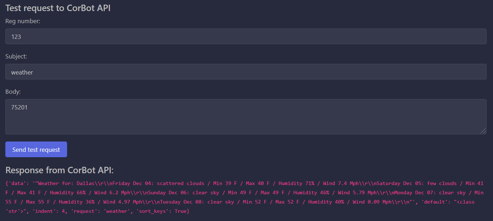

# CorBot API

## How to add modules

1. One can place functions into modules as one likes as far as every function that is intended to be used through this API is imported to ```app.controller.dispatcher``` module and registered in a map called ```MAP``` that is situated at the bottom of that module.
1. If one's function has to use ```session``` or ```metadata```, they have to be imported from module called ```app```.
1. Only modification to functions are:
    1. Delete ```session``` and ```metadata``` from your function's argument list if they are used in your function.


## Exceptions

1. In case some part of the program raising and exception one will get a json with ```error``` filed with a message. E.g. entering a name of a service that is not supported will return a json 
```yaml
{
    "doc": "Name not found globally.",
    "error": "Such service is not supported"
}
```

## Example of creating request:
1. Go to corbot_api and send test request.

    1. In `Reg number` field add reg number.
    1. In `Subject` enter name of sevice.
    1. In `Body` field add data you need to send.

    

